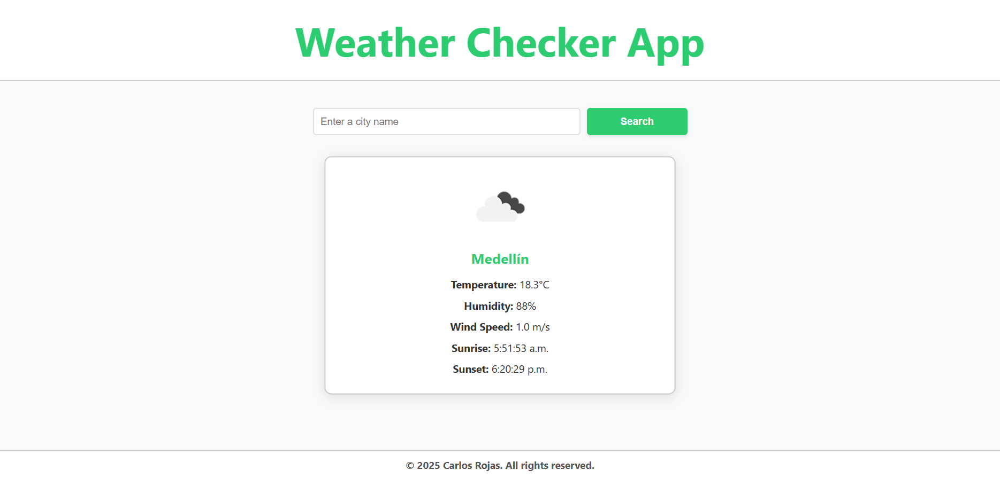

# 🌤️ Weather Checker App

A simple, responsive weather web application built with **HTML**, **CSS**, and **JavaScript**, using **OpenWeather API** to retrieve real-time weather data. Styled alerts are integrated via **SweetAlert2** and HTTP requests are handled with **Axios**.

## 🖼️ Preview



## 🚀 Features

- 🔍 Search by city name
- 🌡️ Displays temperature, humidity, wind speed, sunrise and sunset
- 🎯 Input validation with user-friendly alerts
- 💡 Dynamic weather icon based on current conditions
- 💫 Animated result card on each new search
- 🧼 Clears and focuses input after each search
- 📱 Fully responsive design

## 🛠️ Technologies Used

- **HTML5**
- **CSS3**
- **JavaScript (ES6+)**
- **Axios**
- **SweetAlert2**
- **OpenWeatherMap API**

## 📁 Project Structure

```bash
weather-checker-app/
│
├── index.html
├── .env.example
├── package.json
├── package-lock.json
├── .gitignore
├── LICENSE
├── README.md
│
├── assets/
│   └── img/
│       └── preview.png
│
└── src/
    ├── main.js
    └── styles.css
```

- `index.html`: Main HTML structure of the app.
- `.env.example`: Environment variable example file to define the API key.
- `package.json`: Project metadata and list of dependencies.
- `package-lock.json`: Lockfile that ensures consistent dependency versions.
- `.gitignore`: Specifies files/folders to be ignored by Git (e.g., `.env`).
- `LICENSE`: License file (MIT).
- `README.md`: Project documentation and setup instructions.
- `assets/img/preview.png`: UI preview screenshot shown in the README.
- `src/main.js`: Main JavaScript logic for fetching and displaying weather data.
- `src/styles.css`: Custom styles and responsive layout for the app.

## 📦 Installation

1. **Clone this repository:**

   ```bash
   git clone https://github.com/tu-usuario/weather-checker-app.git
   cd weather-checker-app
   ```

2. Install dependencies:

   ```bash
   npm install
   ```

3. Add your API key:

   Copy the `.env.example` file and rename it to `.env`, then add your API key:
   
   ```bash
   VITE_API_KEY=your_api_key_here
   ```

4. Start the development server (if using Vite):

   ```bash
   npm run dev
   ```

## 🔐 API Key
This app uses the [OpenWeatherMap API](https://openweathermap.org/api). You need to sign up and generate a free API key.

## 📌 Notes

- API key is stored securely using Vite environment variables
- Uses modern ES modules and `type="module"` in script tag
- Accessible form elements (`aria-live`, `visually-hidden`, `label for`, etc.)

## 📄 License

This project is licensed under the MIT License – see the [LICENSE](https://github.com/Carturo8/Weather-Checker-App/blob/main/LICENSE) file for more details.
